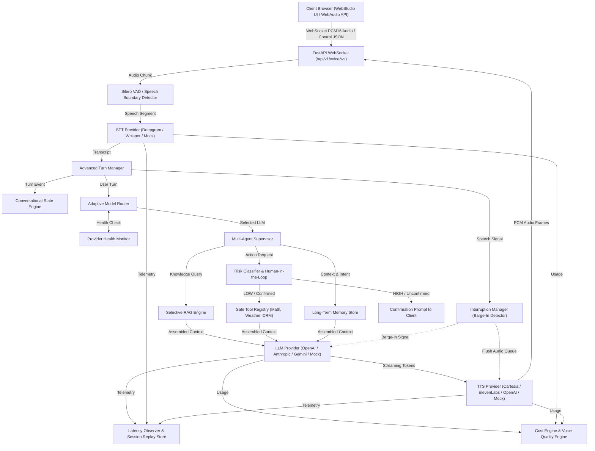

# VoxPilot AI — Real-Time Voice Agent Platform

<div align="center">


[](https://voxpilot-two.vercel.app/)


**An enterprise real-time Voice AI Agent platform with adaptive multi-model routing,
long-term memory, Human-in-the-Loop safety, and full-stack observability.**

> 🚀 **Live Production App**: Try VoxPilot Web Studio live at **[https://voxpilot-two.vercel.app](https://voxpilot-two.vercel.app)**

*Designed and engineered by [Srinath Doggala](https://github.com/srinathdoggala-tech)*

</div>

---

## 🌟 What is VoxPilot?

**VoxPilot AI** is an advanced, production-grade real-time Voice AI Agent platform. It combines low-latency voice pipeline orchestration with intelligent multi-model routing, persistent user memory, real-time sentiment adaptation, and comprehensive observability — all accessible through a single WebSocket interface.

---

## ✨ Core Platform Capabilities

| Feature | Description |
|:--------|:------------|
| 🤖 **Adaptive Model Router** | Cost-, latency-, and complexity-aware LLM selection (`gpt-4o-mini`, `claude-3-5-sonnet`, `gemini-1.5-flash`) with provider health checks (`HEALTHY`, `DEGRADED`, `UNAVAILABLE`) |
| 🗣️ **Advanced Turn Manager** | Classifies turn states (`BACKCHANNEL`, `HESITATION`, `OVERLAP`, `SILENCE_TIMEOUT`) and filters backchannels without interrupting audio playback |
| 🎭 **Conversational State Engine** | Derives user sentiment (`CALM`, `CONFUSED`, `FRUSTRATED`, `ENGAGED`, `RUSHING`) to dynamically adapt assistant response verbosity |
| 🧠 **Long-Term Memory Store** | Captures persistent user facts, preferences, and entities across sessions with confidence thresholds (`>= 0.70`) |
| ⏱️ **Task Scheduler** | Session-surviving background task scheduler with retries, timeouts, and cancellation |
| 🛡️ **Human-in-the-Loop Guard** | Categorizes tool execution risks into `LOW`, `MEDIUM`, `HIGH`, `BLOCKED` with explicit user confirmation guards |
| 📽️ **Session Replay Store** | Timestamped turn timeline logging (`USER_SPEECH`, `STT_FINAL`, `AGENT_DECISION`, `TOOL_CALL`, `LLM_FIRST_TOKEN`, `TTS_FIRST_AUDIO`, `USER_INTERRUPT`) |
| 💰 **Real-Time Cost Engine** | Calculates estimated costs for LLM tokens, STT duration, TTS characters, and embeddings |
| ⚔️ **Model Evaluation Arena** | Side-by-side multi-model benchmark comparisons evaluating quality, latency, cost, and tool correctness |
| 🧪 **Failure Injection Testing** | Test suite verifying system recovery under STT failure, TTS failure, LLM timeout, empty RAG, tool timeout, and network disconnects |

---

## 🏗️ System Architecture



---

## 📁 Project Structure

```
voxpilot/
├── agents/          # Multi-agent supervisor logic
├── api/             # FastAPI server & WebSocket endpoints
├── conversation/    # Conversational state engine & turn manager
├── db/              # Database layer
├── evals/           # Model evaluation arena & benchmark suite
├── memory/          # Long-term memory store
├── observability/   # Latency observer, cost engine, session replay
├── pipeline/        # Core frame-based processing pipeline
├── providers/       # LLM, STT, TTS provider abstractions
├── rag/             # Selective RAG engine
├── reliability/     # Failure injection & recovery testing
├── security/        # Risk classifier & Human-in-the-Loop
├── tasks/           # Background task scheduler
├── tools/           # Safe tool registry
└── config.py        # Platform configuration
```

---

## 📡 API Endpoints

| Endpoint | Protocol | Description |
|:---------|:--------:|:------------|
| `/api/v1/voice/ws` | `WS` | Real-time full-duplex PCM audio streaming & conversation |
| `/api/v1/health` | `GET` | System health check & active provider status |
| `/api/v1/knowledge/ingest` | `POST` | Ingest knowledge documents into vector store for RAG |
| `/api/v1/knowledge/list` | `GET` | List all ingested knowledge documents |
| `/api/v1/sessions` | `GET` | List active & past voice sessions |
| `/api/v1/sessions/{id}/replay` | `GET` | Retrieve timestamped event timeline for session replay |
| `/api/v1/evals/run` | `POST` | Trigger Model Evaluation Arena & benchmark suite |
| `/app/` | `HTTP` | Web Studio UI & Developer Telemetry Console |

---

## 🚀 Quick Start

### 1. Clone the Repository
```bash
git clone https://github.com/srinathdoggala-tech/voxpilot.git
cd voxpilot
```

### 2. Environment Setup
```bash
cp .env.example .env
# Fill in your API keys
```

### 3. Install Dependencies
```bash
uv sync --group dev
```

### 4. Run VoxPilot Server
```bash
uv run python -m voxpilot.api.server
```
Open **`http://localhost:8000/app/`** to launch the Web Studio UI.

### 5. Run Test Suite
```bash
# Windows PowerShell
$env:PYTHONPATH="."
uv run pytest tests/voxpilot/ -v

# macOS / Linux
PYTHONPATH=. uv run pytest tests/voxpilot/ -v
```

### 6. Docker Deployment
```bash
docker-compose up --build -d
```

---

## 🔑 Environment Variables

| Variable | Description |
|:---------|:------------|
| `OPENAI_API_KEY` | OpenAI API key (GPT-4o, Whisper, TTS) |
| `ANTHROPIC_API_KEY` | Anthropic API key (Claude) |
| `GOOGLE_API_KEY` | Google API key (Gemini) |
| `DEEPGRAM_API_KEY` | Deepgram API key (STT) |
| `CARTESIA_API_KEY` | Cartesia API key (TTS) |
| `ELEVENLABS_API_KEY` | ElevenLabs API key (TTS) |

---

## 🛠️ Tech Stack

- **Runtime**: Python 3.12+
- **Web Framework**: FastAPI + WebSockets
- **LLM Providers**: OpenAI, Anthropic (Claude), Google (Gemini)
- **STT Providers**: Deepgram, OpenAI Whisper
- **TTS Providers**: Cartesia, ElevenLabs, OpenAI
- **VAD**: Silero VAD
- **Package Manager**: uv
- **Containerization**: Docker + Docker Compose
- **Frontend**: Vanilla JS + Web Audio API (Web Studio UI)

---

## 📚 Technical Documentation

| Document | Description |
|:---------|:------------|
| 📋 [Implementation Verification Audit](docs/IMPLEMENTATION_VERIFICATION.md) | Comprehensive audit of all implemented features |
| 🏗️ [Real Runtime Architecture](docs/REAL_RUNTIME_ARCHITECTURE.md) | Detailed architecture specification |
| 🧱 [Dependency & Code Boundaries](docs/DEPENDENCY_BOUNDARIES.md) | Code boundary and dependency audit |
| 📜 [Open Source Attribution](docs/OPEN_SOURCE_ATTRIBUTION.md) | Open source licensing & attribution |
| ⚡ [Failure Recovery Matrix](docs/FAILURE_RECOVERY_MATRIX.md) | Chaos testing & failure recovery scenarios |
| 🎯 [Portfolio Overview](docs/PORTFOLIO_OVERVIEW.md) | Portfolio overview & specification |
| 🗺️ [Advanced Architecture Plan](docs/ADVANCED_ARCHITECTURE_PLAN.md) | Extended architecture plan |
| 🔒 [Security Audit](docs/SECURITY_AUDIT.md) | Security specification & audit |

---

## 👤 Author & Maintainer

<div align="center">

**Srinath Doggala**

[](https://github.com/srinathdoggala-tech)
[](mailto:doggalasrinath@gmail.com)

</div>

---

## 📄 License

VoxPilot AI is released under the [BSD-2-Clause License](LICENSE).
