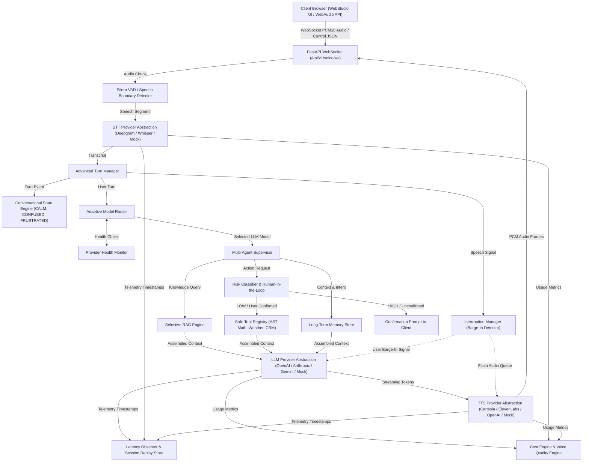

# VoxPilot AI — Advanced Real-Time Voice Agent Platform


**VoxPilot AI** is an advanced, production-grade real-time Voice AI Agent platform. Built with adaptive multi-model routing, turn state classification (backchannels, hesitations, overlaps), user sentiment detection, personal long-term memory, background long-running task scheduling, risk-classified Human-in-the-Loop tool execution, developer session replay, real-time cost estimation, multi-model evaluation arena, and comprehensive observability.

---

## 💡 Open-Source Foundation vs. VoxPilot Application Architecture

VoxPilot AI is an **independent Voice AI platform** built on top of open-source real-time audio orchestration technologies.

### Open-Source Foundation (Pipecat `BSD-2-Clause`)
- **Real-Time Frame Processing**: Low-level audio frame processor base (`FrameProcessor`).
- **Media Transports**: WebRTC and WebSocket transport connection abstractions.
- **Service Integration Interfaces**: Base input/output stream adapters.

### Original VoxPilot Platform Capabilities (`voxpilot/`)
- **Adaptive Multi-Model Router**: Cost-, latency-, and complexity-aware LLM selection (`gpt-4o-mini`, `claude-3-5-sonnet`, `gemini-1.5-flash`) with provider health checks (`HEALTHY`, `DEGRADED`, `UNAVAILABLE`).
- **Advanced Turn Manager**: Classifies turn states (`BACKCHANNEL`, `HESITATION`, `OVERLAP`, `SILENCE_TIMEOUT`) and filters ignored backchannels ("uh-huh") without interrupting assistant audio playback.
- **Conversational State Engine**: Derives user sentiment (`CALM`, `CONFUSED`, `FRUSTRATED`, `ENGAGED`, `RUSHING`) to dynamically adapt assistant response verbosity.
- **Personal Long-Term Memory Store**: Captures persistent user facts, preferences, and entities across sessions with confidence thresholds (`>=0.70`).
- **Long-Running Task Scheduler**: Session-surviving background task scheduler with retries, timeouts, and cancellation.
- **Human-in-the-Loop Risk Classifier**: Categorizes tool execution risks into `LOW`, `MEDIUM`, `HIGH`, `BLOCKED` with explicit user confirmation guards.
- **Developer Session Replay Store**: Timestamped turn timeline logging (`USER_SPEECH`, `STT_FINAL`, `AGENT_DECISION`, `RAG_SEARCH`, `TOOL_CALL`, `LLM_FIRST_TOKEN`, `TTS_FIRST_AUDIO`, `USER_INTERRUPT`).
- **Real-Time Cost Engine**: Calculates estimated costs for LLM tokens, STT duration, TTS characters, and embeddings.
- **Model Evaluation Arena**: Side-by-side multi-model benchmark comparisons evaluating quality, latency, cost, and tool correctness.
- **Controlled Failure Injection Testing**: Failure injection test suite verifying system recovery under STT failure, TTS failure, LLM timeout, LLM 500, empty RAG, tool timeout, and network disconnects.

---

## 🏗️ Real Runtime System Architecture



---

## 📦 Running Locally

### 1. Requirements
- Python 3.11 or 3.12+
- `uv` package manager

### 2. Environment Setup
```bash
cp .env.example .env
```

### 3. Run Server
```bash
uv run python -m voxpilot.api.server
```
Open `http://localhost:8000/app/` in your browser to launch the **VoxPilot Web Studio UI**.

---

## 🧪 Running Test Suite

Run the full test suite including failure injection and advanced systems tests:

```bash
uv run pytest tests/voxpilot/ -v
```

---

## 🐳 Docker Deployment

```bash
docker-compose up --build -d
```

---

## 📚 Documentation Index

- [Implementation Verification Audit](docs/IMPLEMENTATION_VERIFICATION.md)
- [Real Runtime Architecture](docs/REAL_RUNTIME_ARCHITECTURE.md)
- [Dependency & Code Boundaries](docs/DEPENDENCY_BOUNDARIES.md)
- [Open Source Attribution Notice](docs/OPEN_SOURCE_ATTRIBUTION.md)
- [Failure Recovery Matrix](docs/FAILURE_RECOVERY_MATRIX.md)
- [Portfolio Overview](docs/PORTFOLIO_OVERVIEW.md)
- [Resume Bullet Points](docs/RESUME_BULLETS.md)
- [Interview Architecture Guide](docs/INTERVIEW_GUIDE.md)
- [Advanced Architecture Plan](docs/ADVANCED_ARCHITECTURE_PLAN.md)
- [Security Audit Specification](docs/SECURITY_AUDIT.md)

---

## 📄 License

VoxPilot AI is released under the [BSD-2-Clause License](LICENSE).
