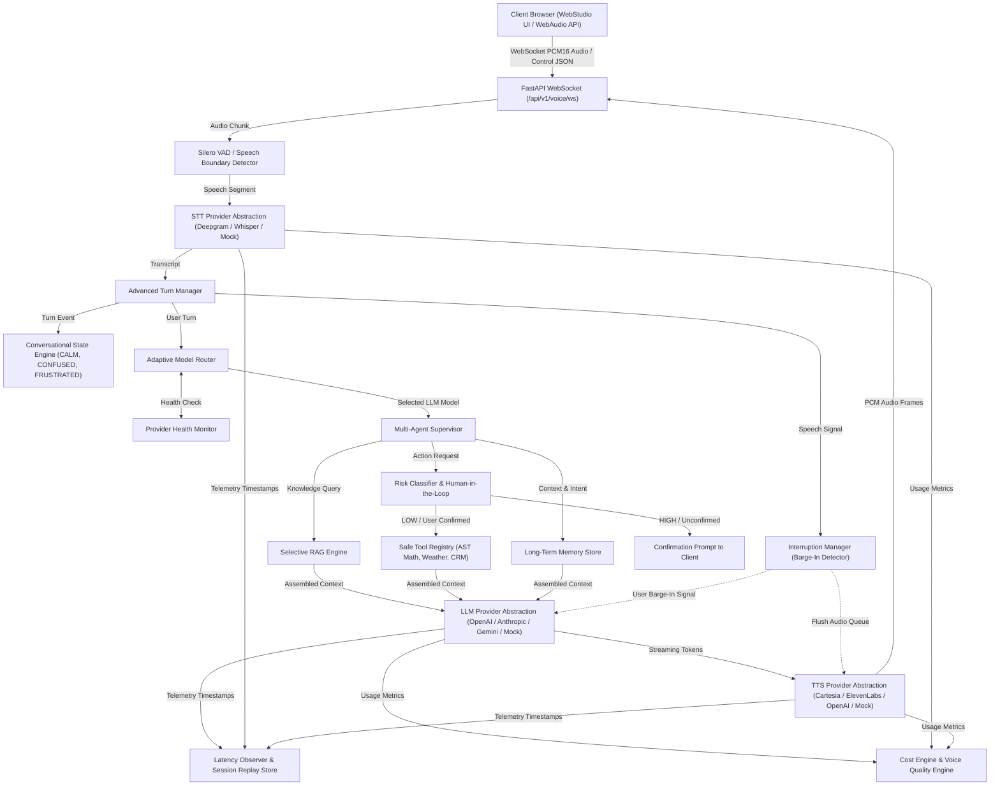

# VoxPilot AI — Real Runtime System Architecture

## 1. Executable Runtime Data Flow Architecture

The diagram below documents the exact runtime execution path of an active VoxPilot AI voice session:

---

## 2. Component Runtime Participation Matrix

1. **FastAPI Endpoint (`voxpilot/api/v1/voice.py`)**: Manages WebSocket lifecycle, ingests PCM audio frames, and sends turn response JSON payloads.
2. **Turn Manager (`voxpilot/pipeline/turn_manager.py`)**: Evaluates turn state (`BACKCHANNEL`, `HESITATION`, `OVERLAP`, `USER_INTERRUPTED`).
3. **Conversational State Engine (`voxpilot/conversation/state_engine.py`)**: Tracks user sentiment state (`CALM`, `CONFUSED`, `FRUSTRATED`) to adapt response verbosity.
4. **Adaptive Model Router (`voxpilot/agents/model_router.py`)**: Consults `ProviderHealthMonitor` to select optimal LLM based on query complexity and target latency.
5. **Multi-Agent Supervisor (`voxpilot/agents/supervisor.py`)**: Orchestrates domain agents (`KnowledgeAgent`, `TaskAgent`, `SupportAgent`, `GeneralAgent`).
6. **Risk Classifier (`voxpilot/security/risk.py`)**: Evaluates tool execution side-effects (`LOW`, `MEDIUM`, `HIGH`, `BLOCKED`).
7. **Session Replay & Cost Engine (`voxpilot/observability/`)**: Records timestamped timeline events and computes real-time token/audio cost estimates.
